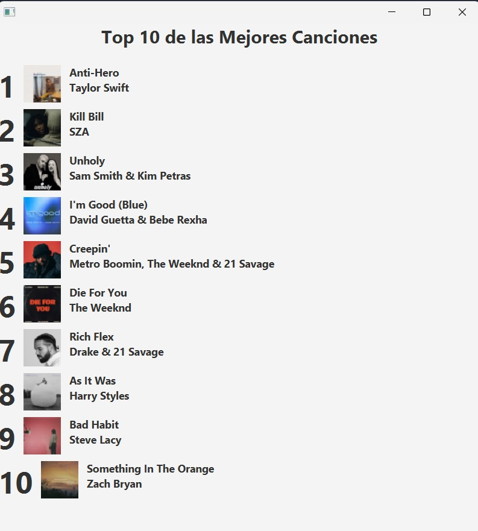
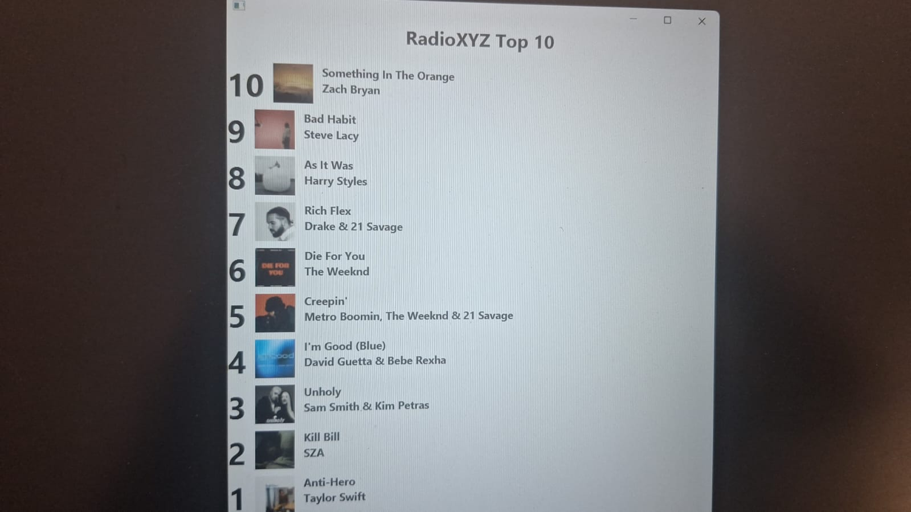
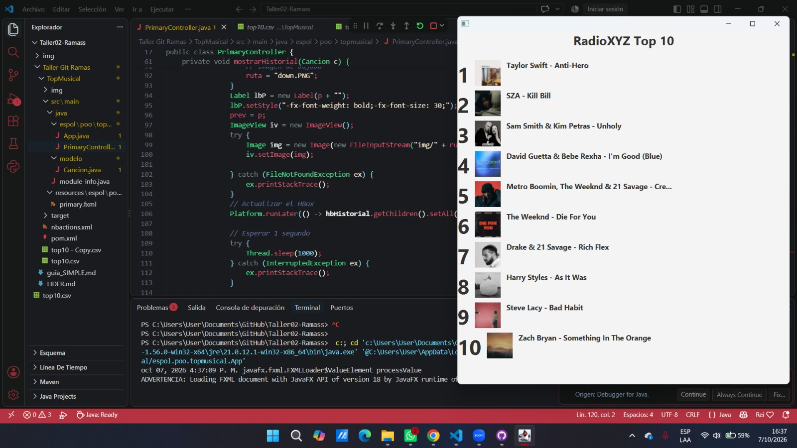
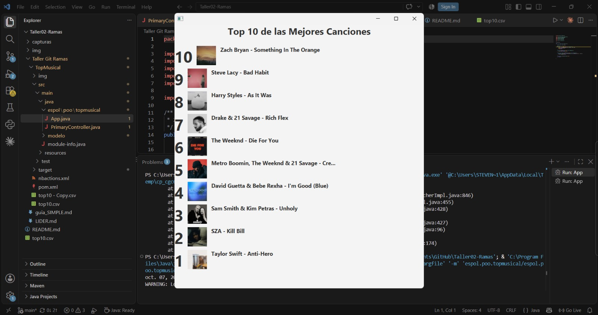

# Taller 02: Manejo de Ramas y Resolución de Conflictos en Git

**Materia:** Programación Orientada a Objetos  
**Institución:** ESPOL  

---

## Integrantes del Equipo

| Integrante | Rol | Rama Asignada |
| **Freddy Steven Sánchez Saavedra** | Líder de equipo | `titulo` |
| **Wilson Ignacio Chan Macías** | Integrante 1 | `orden` |
| **Ricardo Andres Soledispa Pihuave** | Integrante 2 | `artista` |

---

## Resumen de Modificaciones por Rama

### 1. Rama `titulo` (Líder)
* **Objetivo:** Modificar el título principal visible de la aplicación.
* **Archivos modificados:** `primary.fxml`, `PrimaryController.java` y recursos base (`top10.csv`, carpeta `img/`).
* **Cambio realizado:** Se actualizó el encabezado superior de la vista para mostrar *"Top 10 de las Mejores Canciones"*.

### 2. Rama `orden` (Integrante 1)
* **Objetivo:** Invertir el orden de presentación del ranking de canciones.
* **Archivos modificados:** `Cancion.java`.
* **Cambio realizado:** Se ajustó el método de comparación de la clase para ordenar las canciones de forma descendente (del puesto 10 al 1).

### 3. Rama `artista` (Integrante 2)
* **Objetivo:** Ajustar la presentación de los detalles del artista en la vista.
* **Archivos modificados:** `PrimaryController.java` / `Cancion.java`.
* **Cambio realizado:** Se configuró el formato de visualización del artista correspondiente a cada tema.

---

## Evidencias de Ejecución Individual

### Rama `titulo`

### Rama `orden`

### Rama `artista`

---

## 🔀 Proceso de Fusión y Resolución de Conflictos

1. **Estrategia de Integración:**
   * Cada integrante trabajó de forma aislada en su rama local y publicó sus cambios en el repositorio remoto.
   * La integración a la rama principal (`main`) se realizó de manera secuencial a través de `git merge`.

2. **Resolución de Conflictos:**
   * Al fusionar las ramas con modificaciones concurrentes en archivos comunes (como controladores y vistas FXML), surgieron conflictos marcados por Git.
   * Se revisaron y editaron las líneas en conflicto eliminando los delimitadores (`<<<<<<<`, `=======`, `>>>>>>>`) y preservando los aportes individuales de cada integrante sin romper la compilación de JavaFX.

---

## 🏁 Resultado Final de la Aplicación en `main`

Vista de la aplicación con todas las ramas integradas y resueltas:

